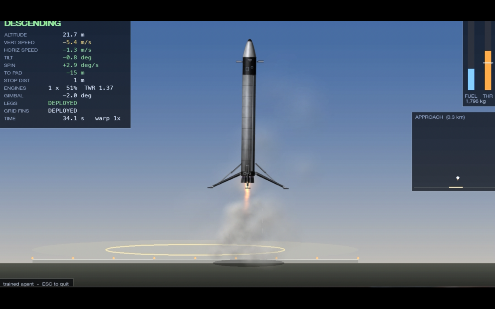

# Rocket Landing AI

An AI that teaches itself to land a reusable rocket booster on a landing pad, much like a SpaceX Falcon 9.

Nobody tells the AI how to land. It crashes thousands of times in a physics simulation, and from each attempt it slowly learns what works: when to fire the engine, how to steer toward the pad, and when to put the legs down.

## 🚀 Rocket

<p align="center">
  
</p>
---
[▶️ Watch the Rocket-Landing-AI Demo](https://www.youtube.com/watch?v=f0YVHjock84)

---

## Results

The final AI (`ap3`) was tested on 200 random landings, starting between 500 m and 2.6 km up and falling at up to 180 m/s:

| Result | How often |
|---|---|
| Landed on the pad (90 m wide, about the size of a real SpaceX landing zone) | **65%** |
| Landed safely, but beside the pad | 32.5% |
| Crashed | **2.5%** |
| Tilt when touching down | about **1°** (a perfect landing is 0°) |

In plain words, it lands safely about 97 times out of 100 and hits the pad about 2 times out of 3.

---

## How it works (simple version)

### 1. The simulation (the "game")
A physics engine models a real-ish booster: its weight, the engine's thrust, gravity, air drag, fuel burning off, grid fins, landing legs, and so on. A landing only counts if the rocket touches down:
- slower than **4 m/s** going down
- slower than **2.5 m/s** sideways
- tilted less than **8°**
- with the **landing legs fully out**

Anything else counts as a crash.

### 2. The controls
The AI has three controls, the same ones a pilot would have:

| Control | What it does |
|---|---|
| **Throttle** | How hard the main engine pushes |
| **Lean** | Which way to tilt the rocket, from 12° left to 12° right |
| **Legs** | Deploy or stow the landing legs |

There's only one engine, so to move **sideways** the rocket **leans**. Part of the engine's push then goes sideways, the same way a helicopter moves. An **autopilot** holds the lean steady: the AI decides "lean 5° left", and the autopilot moves the engine nozzle, the small side thrusters and the grid fins to hold it. Real rockets split the work the same way.

### 3. Learning (reinforcement learning)
The AI starts out knowing nothing and gets **points** after every move:
- **More points:** getting closer to the pad, slowing down in time, staying upright, landing on the pad
- **Fewer points:** crashing, missing the pad, wasting fuel, hovering around, flying away

Over millions of practice flights it learns which actions earn the most points. The method is called **PPO** (Proximal Policy Optimization), a standard learning method in reinforcement learning.

### 4. Easy first, then harder (curriculum)
Like learning to drive in an empty car park before a highway, training starts with **easy** landings (low, slow, close to the pad) and slowly moves to **hard** ones. In the last stage the pad also **shrinks** from 300 m to 90 m wide.

---

## Setup

You need Python 3.10 or newer.

```bash
cd rocket
python3 -m venv .venv
source .venv/bin/activate          # on Windows: .venv\Scripts\activate
pip install -r requirements.txt
```

---

## Watch the AI land

```bash
python tools/watch.py --model runs/ap3/best_model.zip --autopilot --pad-width 90
```

A window opens and the AI flies 10 landings. The result of each flight prints in the terminal. Press `Esc` to quit.

| Want | Add this |
|---|---|
| A different set of flights | `--seed 1234` (any number) |
| More flights | `--episodes 20` |
| Easier starting conditions | `--difficulty 0.5` |

Models trained **with** the autopilot (`ap1`, `ap2`, `ap3`) need `--autopilot`. Models trained without it (`v3` to `v5`) must **not** have it. With the wrong setting, the AI uses the wrong controls and flies badly.

---

## Fly it yourself

```bash
python tools/fly.py
```

| Key | Action |
|---|---|
| `↑` / `↓` | Throttle up / down |
| `Z` / `X` | Full throttle / engine off |
| `←` / `→` | Steer |
| `L` | Landing legs |
| `F` | Grid fins |
| `G` | Switch between 1, 3 and 9 engines |
| `T` | Speed up time |
| `P` | Pause |
| `1`–`4` | Change scenario |
| `R` | Restart |
| `Esc` | Quit |

It's much harder than it looks.

---

## Train it yourself

Training runs on your computer's processor (no graphics card needed). On a MacBook it does about 1 million practice steps every 2 minutes.

**The simplest way** is to train from scratch:
```bash
caffeinate -i python tools/train.py --autopilot --steps 30000000 --name my_run --ramp 0.3
```
(`caffeinate -i` keeps a Mac awake. Leave it out on Windows or Linux.)

**To get the best results**, train in stages, the way the final model was made:

```bash
# Stage 1: learn to land (big 300 m pad), about 1 hour
caffeinate -i python tools/train.py --autopilot --steps 30000000 --name ap1 --ramp 0.3 --eval-every 500000 --eval-episodes 100

# Stage 2: shrink the pad from 300 m to 90 m, about 1 hour
caffeinate -i python tools/train.py --resume runs/ap1/best_model.zip --autopilot --pad-start 300 --pad-width 90 --ramp 0.5 --start-difficulty 1.0 --lr 1e-4 --steps 30000000 --name ap2 --eval-every 500000 --eval-episodes 100

# Stage 3: fine-tune with slower, careful learning, about 40 min
caffeinate -i python tools/train.py --resume runs/ap2/best_model.zip --autopilot --pad-width 90 --start-difficulty 1.0 --lr 5e-5 --steps 20000000 --name ap3 --eval-every 500000 --eval-episodes 100
```

**While it trains**, it tests itself every so often and prints a line like this:
```
[ 45.4 min] steps 55,000,000  difficulty 1.00  pad  90 m  landed on pad  63.0%  ...  <- new best, saved
```
Keep an eye on **`landed on pad %`**. The best version is saved automatically, and you can press `Ctrl+C` at any time to stop safely.

**Test a trained model** on 200 flights:
```bash
python tools/train.py --eval runs/ap3/best_model.zip --autopilot --pad-width 90
```

### Training options

| Option | What it means |
|---|---|
| `--steps` | How many practice steps to train for |
| `--name` | Folder name under `runs/` where the results are saved |
| `--autopilot` | AI picks a lean angle and the autopilot holds it (recommended) |
| `--resume` | Continue from a saved model instead of starting from zero |
| `--lr` | Learning speed. Use a smaller value (`1e-4`, `5e-5`) when continuing training, so it doesn't forget what it learned |
| `--ramp` | What share of training goes into slowly making things harder (0.3 = the first 30%) |
| `--start-difficulty` | Where difficulty starts (0 = easy, 1 = full). Use `1.0` when resuming |
| `--pad-width` / `--pad-start` | Final pad width, and the width to shrink from |
| `--envs` | How many simulations run in parallel (default 8) |

---

## Project layout

```
rocket/
├── rocket_sim/
│   ├── physics.py            the physics: gravity, thrust, drag, fuel, landing rules
│   ├── envs/landing_env.py   the "game" the AI plays: controls, points, start positions
│   └── render/               graphics: rocket, flame, sky, pad
├── tools/
│   ├── train.py              train and test the AI
│   ├── watch.py              watch a trained AI fly
│   ├── fly.py                fly the rocket yourself
│   └── preview_rocket.py     look at the rocket model and its parts
├── assets/rocket/            rocket images and size specs
└── runs/                     saved AI models (not stored in git)
```

---

## The journey: what went wrong and how it was fixed

Getting the AI to land took several attempts. Each problem taught it (and us) something:

| Version | Problem | Fix | Result |
|---|---|---|---|
| **First try** | The AI **hovered** until time ran out, because a crash lost points but running out of time cost nothing, so hovering was "safe" | Running out of time now costs points | Still stuck |
| **v2** | It **braked far too early** and crept down slowly. Then it found a loophole: **flying straight up** out of the play area cost fewer points than failing | Fast falling from high up is no longer punished (only speed it can't stop in time is), and flying away became the worst outcome | First landings |
| **v3** | Learned to land, reached 36%, then **forgot everything** and dropped to 0% | Continue from its best moment with a **slower learning speed** | 46% |
| **v4** | Landed softly, but **anywhere**: landing next to the pad earned almost as many points as landing on it | Missing the pad now earns far fewer points | 62% |
| **v5** | About 30% of starts were **impossible**, e.g. 100 m up and 450 m sideways, with no time to get across | Start higher, and low starts begin roughly above the pad, like a real booster | 83% (on the big pad) |
| **ap1** | v5 landed **tilted** (about 4°) | Added the **autopilot** that holds the lean angle, plus bonus points for landing upright | Tilt down to about 1°, no crashes |
| **ap2** | The 300 m pad was far too easy compared to a real one | **Shrank the pad** step by step to 90 m | 60% on the 90 m pad |
| **ap3** | — | Fine-tuned with slower learning | **65% on the 90 m pad** |

**Lessons learned**
1. **The AI does exactly what the points reward, not what you meant.** Every bad habit (hovering, flying away, landing beside the pad) came from a loophole in the points.
2. **Look at what it actually does.** Replaying flights and measuring them found each problem. Just training longer never fixed one.
3. **Make the task possible.** Impossible starts only teach the AI to give up.
4. **Split the job.** Letting the AI pick the direction and a simple autopilot hold it made learning much easier. Real rockets work the same way.
5. **Slow down once it's good.** A high learning speed lets it forget good skills. A lower one keeps them.

---

## Ideas for the future

- **More precise aiming:** the AI sees its sideways position on a scale built for the old 300 m pad. A finer position reading for the small pad should push on-pad landings well above 65%.
- **Wind and gusts**, to make it more realistic.
- **Choosing 1 or 3 engines** for the braking burn, like SpaceX does.
- **Landing on a moving drone ship** at sea.

---

## Built with

- [Gymnasium](https://gymnasium.farama.org/): the standard way to build a "game" for an AI to learn
- [Stable-Baselines3](https://stable-baselines3.readthedocs.io/): the PPO learning algorithm
- [PyTorch](https://pytorch.org/): the neural network behind the AI
- [Pygame](https://www.pygame.org/): graphics and the flight window
- [NumPy](https://numpy.org/): maths
